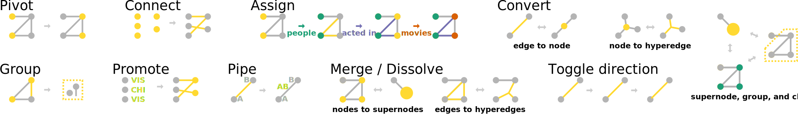

origraph.js
===========


`origraph.js` is a library for wrangling graph data. Graph constructs (like what is a node, and what is an edge) are deliberately lightweight, so that they are easy to map (and re-map) to data items, regardless of how the raw data is structured.



Be advised that this is project is *very* work-in-progress, and is being implemented in parallel with [Origraph](https://github.com/origraph/origraph.js), a non-programmer's visual interface for using this library.
Expect frequent sweeping changes and poor documentation for now, especially as we explore and refine what constructs and operations are even important for this graph data wrangling.

Installation
============
For basic use in the browser:

```html
<script src="https://cdn.jsdelivr.net/npm/origraph@0.1.0/dist/origraph.umd.min.js"></script>
```

For server-side apps or pre-bundled browser apps:

```bash
npm install origraph
```

However, for the latter, be advised that some of the dependencies of this library result in webpack / rollup / whatever configuration hell. If you discover a configuration that actually works, we'd love to hear about it!

Development
===========
## Setup:

```bash
git clone https://github.com/origraph/origraph.js.git
cd origraph.js
npm install
```

## Debugging:
When debugging with the test scripts, launch these as parallel processes:

```
npm run watchcjs
```

```
npm run debug
```

## Debugging in the browser:
When debugging in the browser, launch this in parallel to whatever you're using to debug / serve your web app (make sure to point your app to the built `dist/origraph.umd.js` file):
```
npm run watchumd
```

# Releasing a new version
A list of reminders to make sure we don't forget any steps:

- Update the version in package.json
- Update the release link in this README
- `npm run build`
- `npm run test`
- `git commit -a -m "commit message"`
- `git push`
- (Verify Travis CI doesn't fail)
- `git tag -a #.#.# -m "tag annotation"`
- `git push --tags`
- `npm publish`
- (maybe optional) Edit / document the release on Github, add built files in `dist`
